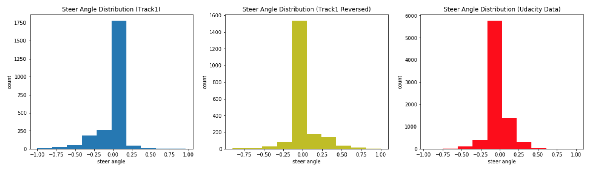
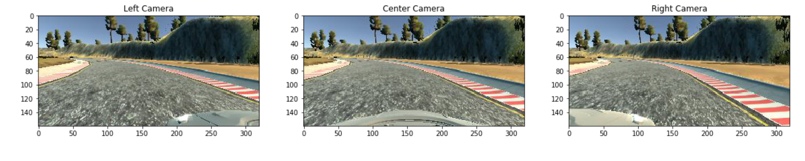
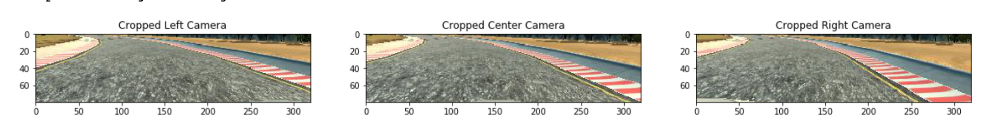

# **Behavioral Cloning for Self-driving Car** 

---

The goals / steps of this project are the following:
* Use the simulator to collect data of good driving behavior
* Build, a convolution neural network in Keras that predicts steering angles from images
* Train and validate the model with a training and validation set
* Test that the model successfully drives around track one without leaving the road
* Summarize the results with a written report

## Rubric Points
Here I will consider the [rubric points](https://review.udacity.com/#!/rubrics/432/view) individually and describe how I addressed each point in my implementation.  

---
## Dataset Summary
The data I used for training the model are collected from track 1 by mannually driving for one clockwise loop and counter-clockwise loop. Additionally, I also include dataset from Udacity.

| Data Type            |     Value	     	 | 
|:--------------------:|:-----------------:| 
| Training Data Size   | 17950   					 | 
| Validation Data Size | 4488	             |
| Test Data Size       | 2494	             |
| Image Shape          | 160 x 320 x 3		 |

The streering angles distribution are shown in Figure 1. As we can see, for the track 1, there are more negative steering angles while counter-clockwise loop has more positive steering angles. Overall, the data is not evenly distributed and the majority of steering angles are around 0.
<p align="center">
  
  <br>
  <em>Figure 1: Distribution of Steering Angles</em>
</p>

The data is evenly distributed for left, center and right images. Sample images are shown as below:
<p align="center">
  
  <br>
  <em>Figure 2: Sample Camera Images</em>
</p>

## Data Preprocessing

Looking at the sample images, the upper and lower portions are irrelevant. So we are cropping those out by adding a cropping layer to the model:
```python
model.add(Cropping2D(cropping=((50,20), (0,0)), input_shape=(160, 320, 3)))
```
The images after cropping are shown as below:
<p align="center">
  
  <br>
  <em>Figure 3: Cropped Sample Camera Images</em>
</p>

Another data augument I did is to flip images and angles. In this way, we can increase the data size to 2x.

## Model Architecture

The architecture of the network is shown as below:

| Layer         	    	|     Description	        		            			| 
|:---------------------:|:---------------------------------------------:| 
| Input         		    | 160 x 320 x 3   						                	| 
| Cropping             	| Upper 50 and lower 20 pixels are cropped out 	| 
| Convolution 5x5     	| 24 filters, 2x2 stride, valid padding         |
| Batch Normalization   |                                               |
| RELU					        |												                        |
| Dropout               | 0.2 dropout rate                              |
| Convolution 5x5 	    | 36 filters, 2x2 stride, valid padding       	|
| Batch Normalization   |                                               |
| RELU					        |												                        |
| Dropout               | 0.2 dropout rate                              |
| Convolution 3x3 	    | 48 filters, 2x2 stride, valid padding       	|
| Batch Normalization   |                                               |
| RELU					        |												                        |
| Dropout               | 0.2 dropout rate                              | 
| Flatten 	        	  |             									                |
| Fully connected		    | output 1024, ReLu Activation					        |
| Fully connected		    | output 256, ReLu Activation			  		        |        								            
| Fully connected		    | output 64, ReLu Activation                    |
| Fully connected		    | output 1        								              |
| MSE                   |                                               |

## Training Strategy

To train this network, we use ```Adam``` optimizer with learning rate of **0.001** for **20** epochs. To get the best model, we save the checking point after each epoch with best validation error. This can be easily implemented using keras:
```python
 checkpointer = ModelCheckpoint(filepath='ckpt/model.hdf5', verbose=1, save_best_only=True)
 adam = Adam(lr=0.001)
 
 model.compile(loss='mean_squared_error', optimizer=adam)
 hist  = model.fit_generator(
      generator = train_generator,
      steps_per_epoch = math.ceil(len(train_samples) / 32.0),
      validation_data = validation_generator,
      validation_steps = math.ceil(len(validation_samples) / 32.0),
      epochs = 20,
      callbacks=[checkpointer],
   )
```
Besides, since we have more than 20k images, it is easy to overwhelm memory usage. To avoid that, we use python generator to produce image data for each batch.

## Evaluation Result

## Improvements

